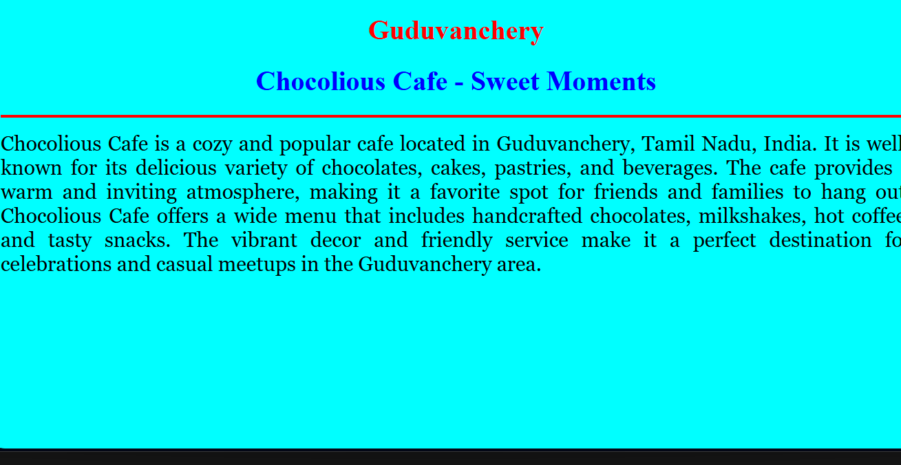

# Ex04 Places Around Me
## Date: 26-04-25

## AIM
To develop a website to display details about the places around my house.

## DESIGN STEPS

### STEP 1
Create a Django admin interface.

### STEP 2
Download your city map from Google.

### STEP 3
Using ```<map>``` tag name the map.

### STEP 4
Create clickable regions in the image using ```<area>``` tag.

### STEP 5
Write HTML programs for all the regions identified.

### STEP 6
Execute the programs and publish them.

## CODE
```
map.html

<!DOCTYPE html>
<html>
<head>
  <title>My City</title>
</head>
<body>
  <center>
    <font color="red"><b>Guduvancherry</b></font>
  </center>
  <center>
    <font color="blue"><b>Yashaswini (212224220123)</b></font>
  </center>
  <center>
    
    <map name="image-map">
      <area target="" alt="shri" title="shri" href="shri.html" coords="415,644,677,779" shape="rect">
      <area target="" alt="choco" title="choco" href="choco.html" coords="1282,835,252" shape="circle">
      <area target="" alt="zud" title="zud" href="zud.html" coords="893,338,1165,440" shape="rect">
    </map>
  </center>
</body>
</html>

shri.html
<!DOCTYPE html>
<html>
<head>
<title>Shri Bhalaji Bhavan</title>
</head>
<body bgcolor="cyan">
<h1 align="center">
<font color="red"><b>Guduvanchery</b></font>
</h1>
<h1 align="center">
<font color="blue"><b>Shri Bhalaji Bhavan - Famous Restaurant</b></font>
</h1>
<hr size="3" color="red">
<p align="justify">
<font face="georgia" size="5">
Shri Bhalaji Bhavan is a popular vegetarian restaurant located in Guduvanchery, 
Tamil Nadu, India. It is well known for its delicious South Indian cuisine, 
offering a wide variety of dishes like dosas, idlis, vadas, pongal, and traditional meals.
 The restaurant is a favorite among travelers and locals alike for its quality food, cleanliness, and quick service. Shri Bhalaji Bhavan has become a landmark stop for people traveling along the GST Road (Grand Southern Trunk Road). 
 It offers a comfortable dining experience with spacious seating and a friendly atmosphere.
</font>
</p>
</body>
</html>
choco.html
<!DOCTYPE html>
<html>
<head>
<title>Chocolious Cafe Guduvanchery</title>
</head>
<body bgcolor="cyan">
<h1 align="center">
<font color="red"><b>Guduvanchery</b></font>
</h1>
<h1 align="center">
<font color="blue"><b>Chocolious Cafe - Sweet Moments</b></font>
</h1>
<hr size="3" color="red">
<p align="justify">
<font face="georgia" size="5">
Chocolious Cafe is a cozy and popular cafe located in Guduvanchery, Tamil Nadu, India.
It is well-known for its delicious variety of chocolates, cakes, pastries, and beverages.
The cafe provides a warm and inviting atmosphere, making it a favorite spot for friends and families to hang out.
Chocolious Cafe offers a wide menu that includes handcrafted chocolates, milkshakes, hot coffee, and tasty snacks.
The vibrant decor and friendly service make it a perfect destination for celebrations and casual meetups in the Guduvanchery area.
</font>
</p>
</body>
</html>
zud.html
<!DOCTYPE html>
<html>
<head>
<title>Zudio Guduvanchery</title>
</head>
<body bgcolor="cyan">
<h1 align="center">
<font color="red"><b>Guduvanchery</b></font>
</h1>
<h1 align="center">
<font color="blue"><b>Zudio - Fashion Store</b></font>
</h1>
<hr size="3" color="red">
<p align="justify">
<font face="georgia" size="5">
Zudio is a popular fashion retail store located in Guduvanchery, Tamil Nadu, India.
It is a part of the Trent Limited group, offering a wide range of affordable and trendy clothing for men, women, and kids.
The store is known for its stylish designs, budget-friendly prices, and good quality.
Zudio Guduvanchery attracts shoppers from nearby areas who are looking for fashionable apparel and accessories. 
With a neat store layout and regular new arrivals, it has become a favorite shopping destination for families and youngsters alike in Guduvanchery.
</font>
</p>
</body>
</html>
```

## OUTPUT
-1.png>)



## RESULT
The program for implementing image maps using HTML is executed successfully.
